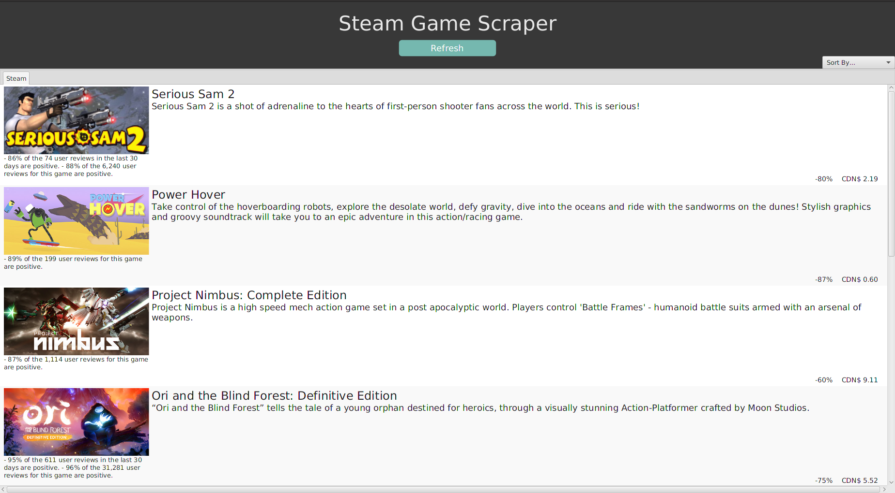

# Java-Web-Scraper
Web scraper built with Java. It's purpose is to scrape games from Reddit that are on sale or free!

## How does it work?
We are using Java to create the models and using the Jsoup framework to scrape data. JavaFX is also used to create a nice
appealing UI.

## Features
* Able to Sort Games based off price, rating and reviews
* Able to refresh the List View

### Screenshots

